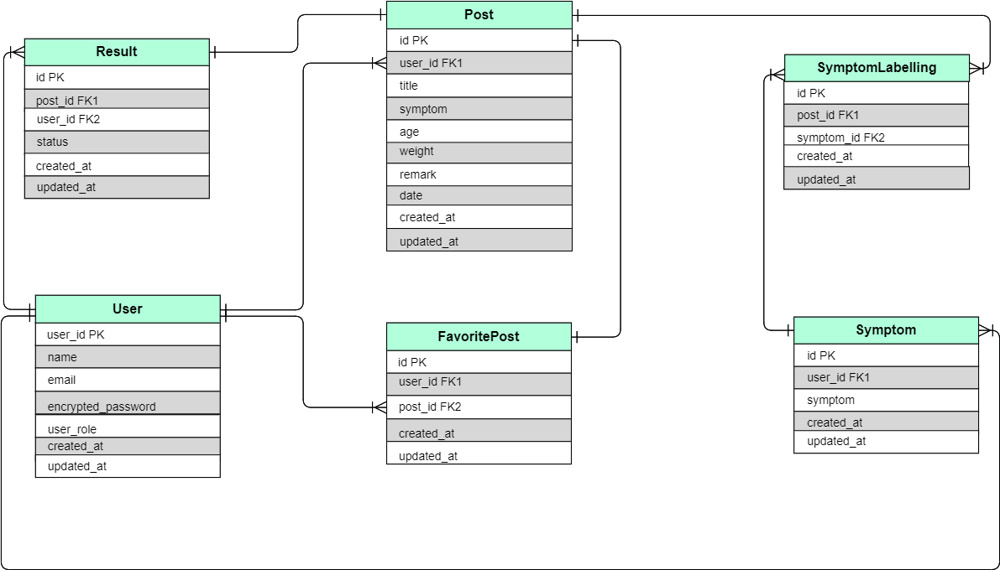

# Hello Doctor
Welcome to Hello Doctor, your friendly application design to get your first medical aid.									

## Requirements

The following steps are necessary to get the application up and running.

### Development Language
```
Ruby 2.6.5
Rails 5.2.6
```
### Employment Term Technology
```
Devise
Ajax
```
### Technology outside the curriculum
```
reCAPTCHA for patients signing up
```
### Execution Procedure

#### Installation Steps

1. Clone repo: `git clone git@github.com:DominiqueElisabeth/Hello_Doctor.git`
2. Change into directory: `cd Hello_Doctor`
3. Install gems: `bundle install`
4. Install JavaScript packages: `yarn install`
5. Create database: `rails db:create`
6. Create tables: `rails db:migrate`
7. Seed database: `rails db:seed`
8. Start the server: `rails s`
9. Visit http://localhost:3000/ and log in with any of the users defined in the [seeds file](https://github.com/DominiqueElisabeth/Hello_Doctor/blob/master/db/seeds.rb).

### Catalogue Design
https://docs.google.com/spreadsheets/d/1hNswJdZqtyMHxdQ6lkTUgmXL_AOjElrFhKUuOzsMI9M/edit

### Table of Definition Document
https://docs.google.com/spreadsheets/d/1L_H8OSIfWpvJQXfxTOUWIq7RsdUIr1m1thVpwnc2uJ4/edit

### Wireframe
https://cacoo.com/diagrams/4uEMLdCzBhqlePEA/FBA38

### ER Diagram

 

### Screen Transition Diagram

 
